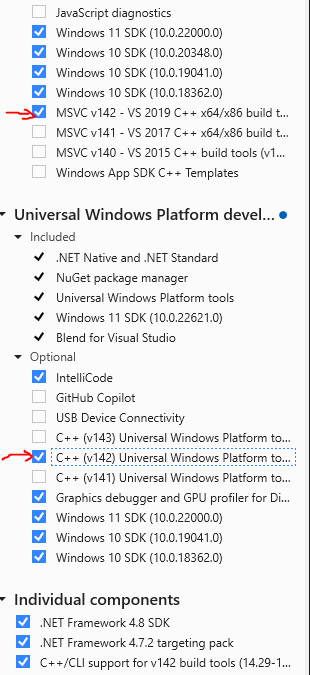

# Speckle Repo Management Templates

[](https://twitter.com/SpeckleSystems) [](https://discourse.speckle.works) [](https://speckle.systems) [](https://speckle.guide/dev/)

## Introduction

This section should hold a quick intro on what this repo's about. For example:

This repo holds Speckle's:

- Default [Code of Conduct](.github/CODE_OF_CONDUCT.md),
- Default [Contribution Guidelines](.github/CONTRIBUTING.md),
- README template (you're reading it now),
- Default [Issue Template](.github/ISSUE_TEMPLATE/ISSUE_TEMPLATE.md),
- Default [Pull Request Template](.github/PULL_REQUEST_TEMPLATE/PR_TEMPLATE.md),
- OSS License (Apache 2.0)

Either copy paste the parts that are useful in existing repos, or use this as a base when creating a new repository.

## Documentation

Comprehensive developer and user documentation can be found in our:

#### 📚 [Speckle Docs website](https://speckle.guide/dev/)

## This Readme Template

Is rather straightforward. It includes several default sections and one section that requires special attention.

Default sections:

- Badges: has several default social badges. Feel free to add more.
- Developing & Debugging - needs filling in!
- Community - can be left as is.

**License section**: If this is a pure OSS repo, like Core, remove everything after the first phrase. Otherwise, we need to plan ahead before releasing and make sure we're covered.

## Developing & Debugging

### Build
What will you need?
- [ArchiCad 27](https://graphisoft.com/downloads/archicad/install/AC27/INT/)
- [CMake](https://cmake.org) – To generate IDE projects (3.16 minimum version is needed)
- [Python](https://www.python.org) – For some build tools (version 2.7+ or 3.8+).
- Visual Studio 2019 or 2022 (v142 toolset)

How to build the AddOn on Windows and **Visual Studio 2022**
- Make sure that your Visual Studio 2022 is installed properly and that you have the v142 toolset installed
- After modifying the installation, a restart may be necessary


- Open the project root and run 'generate_project.bat'
- This will create the build folder and you will find the 'archicad-speckle.sln' in it
- Open the solution file in Visual Studio 2022 and build the project

More Help

- [Getting started with ArchiCad AddOns](https://archicadapi.graphisoft.com/getting-started-with-archicad-add-ons)

### Installation
- Open the Add-On Manager in Archicad (Options menu)
- Click the "Add..." button under "Edit list of available Add-ons"
- Browse ```./build/Int/Debug/Speckle.apx```

### Debugging
- Right-click SpeckleAddOn in the solution explorer
- Click 'Set as Startup Project'
- Click run (Local Windows Debugger)
- By default it will start ArchiCAD 27, make sure that it's installed on your machine

## Contributing

Please make sure you read the [contribution guidelines](.github/CONTRIBUTING.md) and [code of conduct](.github/CODE_OF_CONDUCT.md) for an overview of the practices we try to follow.

## Community

The Speckle Community hangs out on [the forum](https://discourse.speckle.works), do join and introduce yourself & feel free to ask us questions!

## Security

For any security vulnerabilities or concerns, please contact us directly at security[at]speckle.systems.

## License

Unless otherwise described, the code in this repository is licensed under the Apache-2.0 License. Please note that some modules, extensions or code herein might be otherwise licensed. This is indicated either in the root of the containing folder under a different license file, or in the respective file's header. If you have any questions, don't hesitate to get in touch with us via [email](mailto:hello@speckle.systems).
